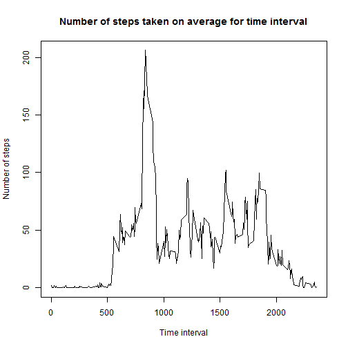

Firstly, I clear all the variables, set figure path for knitr, change directory and read the data:


```r
rm(list = ls())
fig.path = "C:/Users/Timur/Documents/Coursera5/RepData_PeerAssessment1"
#changing directroy to where csv file is
setwd("C:/Users/Timur/Documents/Coursera5/RepData_PeerAssessment1/activity/")
# reading data
data1 <-read.csv("activity.csv", header = TRUE)
#going to working directory
setwd("C:/Users/Timur/Documents/Coursera5/RepData_PeerAssessment1/")
```

Then I remove all the rows with NAs:


```r
dataWONA <- data1[complete.cases(data1[,]),]
```

Histogram of total number of steps taken per day:


```r
dataByDay2 <- aggregate(steps ~ date, dataWONA, sum)
hist(dataByDay2$steps, main = "Histogram of total number of steps taken per day",xlab = "Number of steps taken per day")
```


Calculating the mean and median of steps taken per day:

```r
meanPerDay <- mean(dataByDay2$steps)
cat("Mean number of steps per day = ",meanPerDay, "\n")
```

```
## Mean number of steps per day =  10766.19
```

```r
medianPerDay <- median(dataByDay2$steps)
cat("Median of steps per day = ",medianPerDay, "\n")
```

```
## Median of steps per day =  10765
```


Number of steps taken per each interval (averaged over days):

```r
dataByInterval <- aggregate(steps ~ interval, dataWONA, mean)
plot(dataByInterval$interval,dataByInterval$steps, type = "l",main = "Number of steps taken on average for time interval",xlab = "Time interval",ylab = "Number of steps")
```



Now, taking initial data and calculating number of NAs:

```r
numberOfNA <- sum(is.na(data1$steps))
cat("Number of NA elemetns is", numberOfNA)
```

```
## Number of NA elemetns is 2304
```

Each of NA would be replaced by the average amount of steps for this interval:


```r
# copy of initial dataset
data2 <- data1

# creating a vector that will contain replacements for NAs - amount of steps for this interval
replacement <- rep.int(0, sum(is.na(data1$steps)))
IntervalOfNa <- data2[is.na(data1$steps),3]
for (i in 1:sum(is.na(data1$steps))) {
        replacement[i] <- dataByInterval[which(dataByInterval$interval==IntervalOfNa[i]),2]
}

# replacing the NA values
data2[is.na(data1$steps),1] <- replacement
```


Histogram of total number of steps taken per day:


```r
dataByDay3 <- aggregate(steps ~ date, data2, sum)
hist(dataByDay3$steps, main = "Histogram of total number of steps taken per day, with imputed values",xlab = "Number of steps taken per day")
```


Calculating the mean and median of steps taken per day:

```r
meanPerDay3 <- mean(dataByDay3$steps)
cat("Mean number of steps per day with imputing values = ",meanPerDay3, "\n")
```

```
## Mean number of steps per day with imputing values =  10766.19
```

```r
medianPerDay3 <- median(dataByDay3$steps)
cat("Median of steps per day with imputing values = ",medianPerDay3, "\n")
```

```
## Median of steps per day with imputing values =  10766.19
```


As a result of imputing missing data, mean did not change, but median changed.
  
  
Finding number of steps in interval averaged across weekdays and weekends:


```r
data2$day <- weekdays(as.Date(data2$date))
dataByIntervalWeekEnd <- aggregate(steps ~ interval, data2[data2$day == "Sunday"|data2$day == "Saturday",], mean)
dataByIntervalWeekDay <- aggregate(steps ~ interval, data2[data2$day != "Sunday" & data2$day != "Saturday",], mean)
par(mfrow=c(2,1))
par(mar=c(1.5, 4.5, 1.5, 0.5))
plot(dataByIntervalWeekEnd$interval,dataByIntervalWeekEnd$steps, type = "l",ylab = "Number of steps", xlab = "interval",col = "blue", main = "weeekend")
plot(dataByIntervalWeekDay$interval,dataByIntervalWeekDay$steps, type = "l",ylab = "Number of steps", xlab = "interval", col = "blue", main = "weeekday")
```


