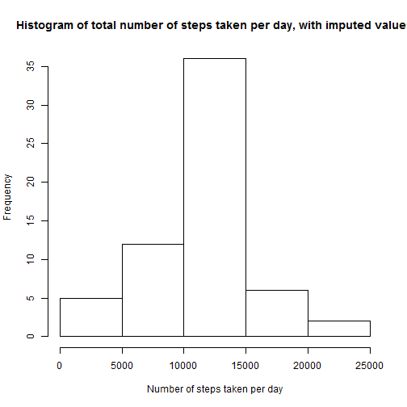
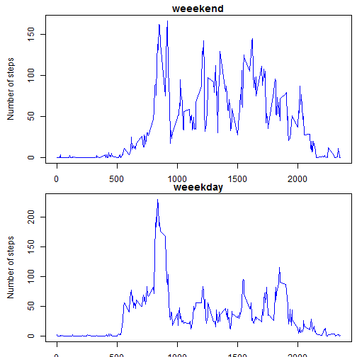

Firstly, I change directory and read the data:


```r
rm(list = ls())
fig.path = "C:/Users/Timur/Documents/Coursera5/RepData_PeerAssessment1"
setwd("C:/Users/Timur/Documents/Coursera5/RepData_PeerAssessment1/activity/")
data1 <-read.csv("activity.csv", header = TRUE)
setwd("C:/Users/Timur/Documents/Coursera5/RepData_PeerAssessment1/")
str(data1)
```

```
## 'data.frame':	17568 obs. of  3 variables:
##  $ steps   : int  NA NA NA NA NA NA NA NA NA NA ...
##  $ date    : Factor w/ 61 levels "2012-10-01","2012-10-02",..: 1 1 1 1 1 1 1 1 1 1 ...
##  $ interval: int  0 5 10 15 20 25 30 35 40 45 ...
```

Then I remove all the rows with NAs:


```r
dataWONA <- data1[complete.cases(data1[,]),]
str(dataWONA)
```

```
## 'data.frame':	15264 obs. of  3 variables:
##  $ steps   : int  0 0 0 0 0 0 0 0 0 0 ...
##  $ date    : Factor w/ 61 levels "2012-10-01","2012-10-02",..: 2 2 2 2 2 2 2 2 2 2 ...
##  $ interval: int  0 5 10 15 20 25 30 35 40 45 ...
```

```r
sum(dataWONA$steps)
```

```
## [1] 570608
```

Histogram of total number of steps taken per day:


```r
dataByDay2 <- aggregate(steps ~ date, dataWONA, sum)
str(dataByDay2)
```

```
## 'data.frame':	53 obs. of  2 variables:
##  $ date : Factor w/ 61 levels "2012-10-01","2012-10-02",..: 2 3 4 5 6 7 9 10 11 12 ...
##  $ steps: int  126 11352 12116 13294 15420 11015 12811 9900 10304 17382 ...
```

```r
hist(dataByDay2$steps)
```


Calculating the mean and median of steps taken per day:

```r
mean(dataByDay2$steps)
```

```
## [1] 10766.19
```

```r
median(dataByDay2$steps)
```

```
## [1] 10765
```


Number of steps taken per each interval (averaged over days):

```r
dataByInterval <- aggregate(steps ~ interval, dataWONA, mean)
plot(dataByInterval$interval,dataByInterval$steps, type = "l")
```


Now, taking initial data and calculating number of NAs:

```r
sum(is.na(data1$steps))
```

```
## [1] 2304
```

Each of NA would be replaced by the average amount of steps for this interval:


```r
str(dataByInterval)
```

```
## 'data.frame':	288 obs. of  2 variables:
##  $ interval: int  0 5 10 15 20 25 30 35 40 45 ...
##  $ steps   : num  1.717 0.3396 0.1321 0.1509 0.0755 ...
```

```r
data2 <- data1
replacement <- rep.int(0, sum(is.na(data1$steps)))
IntervalOfNa <- data2[is.na(data1$steps),3]
for (i in 1:sum(is.na(data1$steps))) {
  replacement[i] <- dataByInterval[which(dataByInterval$interval==IntervalOfNa[i]),2]
}
data2[is.na(data1$steps),1] <- replacement
str(data2)
```

```
## 'data.frame':	17568 obs. of  3 variables:
##  $ steps   : num  1.717 0.3396 0.1321 0.1509 0.0755 ...
##  $ date    : Factor w/ 61 levels "2012-10-01","2012-10-02",..: 1 1 1 1 1 1 1 1 1 1 ...
##  $ interval: int  0 5 10 15 20 25 30 35 40 45 ...
```


Histogram of total number of steps taken per day:


```r
dataByDay3 <- aggregate(steps ~ date, data2, sum)
str(dataByDay3)
```

```
## 'data.frame':	61 obs. of  2 variables:
##  $ date : Factor w/ 61 levels "2012-10-01","2012-10-02",..: 1 2 3 4 5 6 7 8 9 10 ...
##  $ steps: num  10766 126 11352 12116 13294 ...
```

```r
hist(dataByDay3$steps)
```



Calculating the mean and median of steps taken per day:

```r
mean(dataByDay3$steps)
```

```
## [1] 10766.19
```

```r
median(dataByDay3$steps)
```

```
## [1] 10766.19
```


As a result of imputing missing data, mean did not change, but median changed.

Finding number of steps in interval averaged across weekdays and weekends:


```r
data2$day <- weekdays(as.Date(data2$date))
dataByIntervalWeekEnd <- aggregate(steps ~ interval, data2[data2$day == "Sunday"|data2$day == "Saturday",], mean)
dataByIntervalWeekDay <- aggregate(steps ~ interval, data2[data2$day != "Sunday" & data2$day != "Saturday",], mean)
par(mfrow=c(2,1))
plot(dataByIntervalWeekEnd$interval,dataByIntervalWeekEnd$steps, type = "l")
plot(dataByIntervalWeekDay$interval,dataByIntervalWeekDay$steps, type = "l")
```


